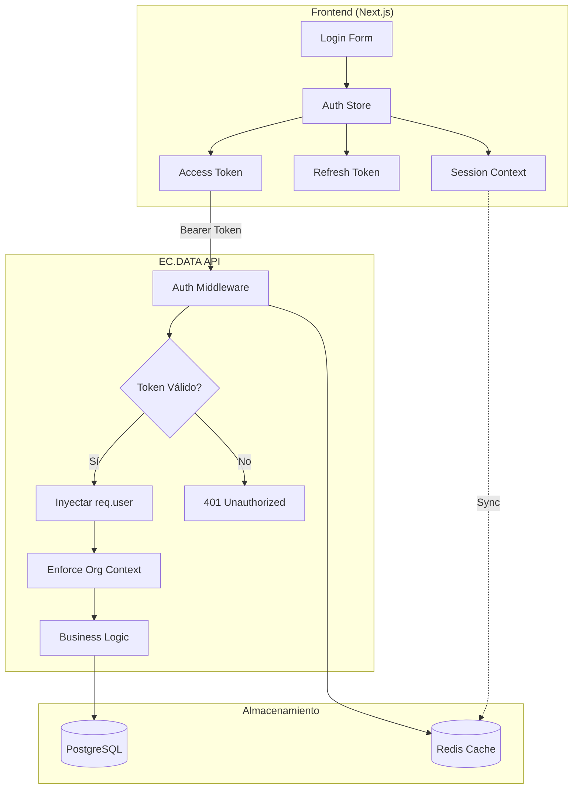
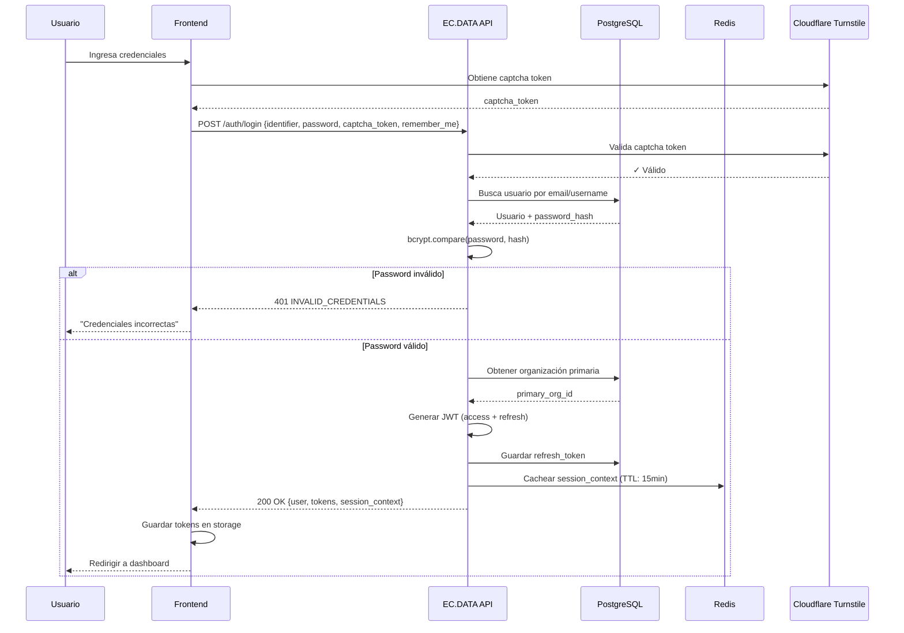
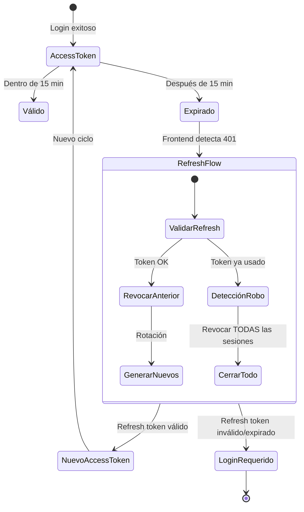
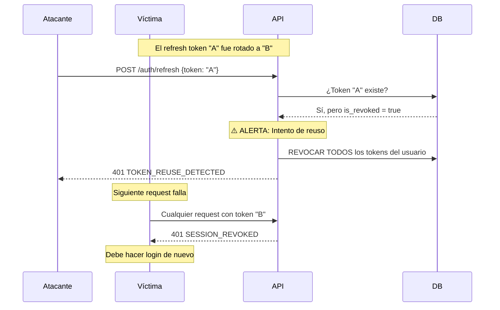
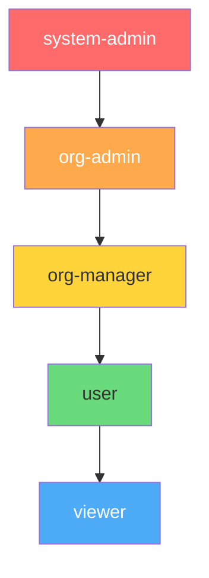
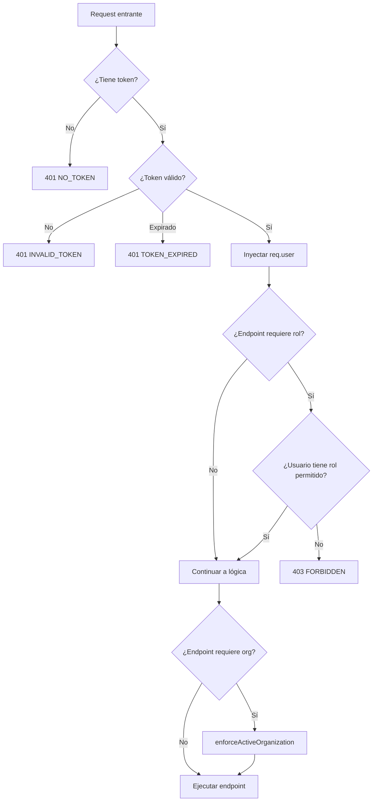
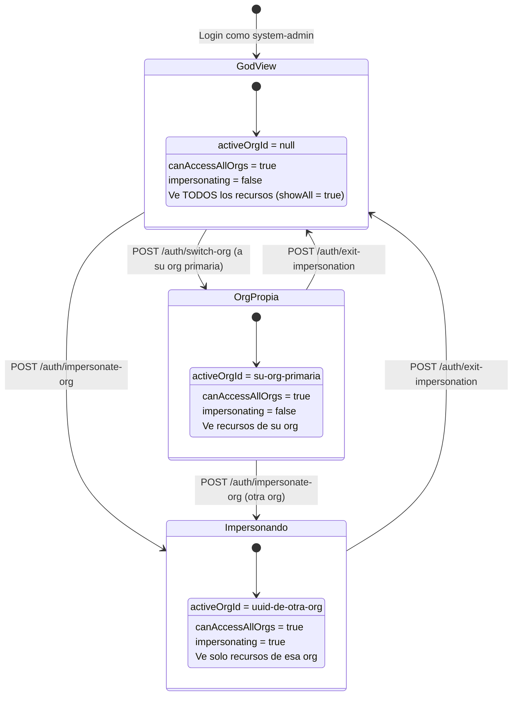
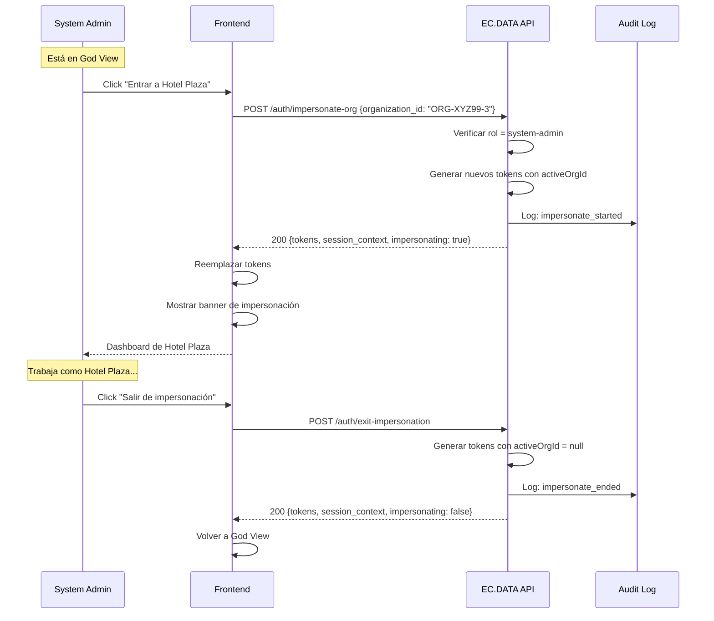
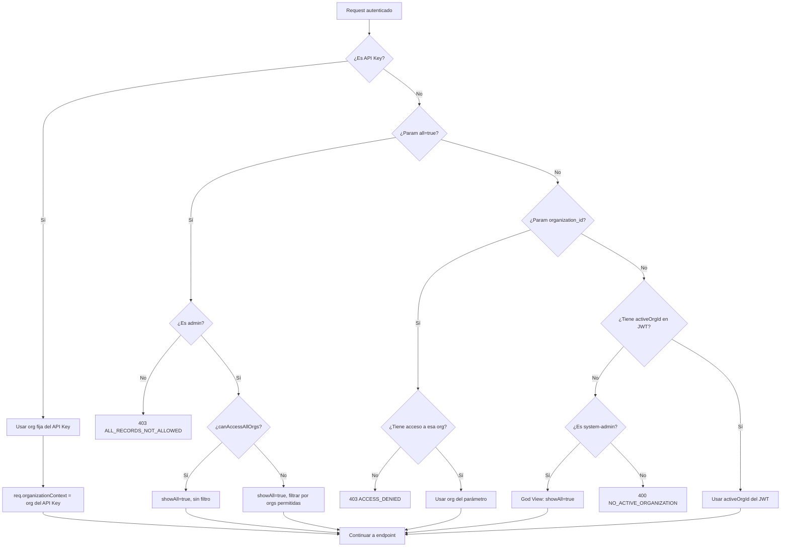

# Sistema de Autenticación EC.DATA API

## Documento Técnico para Frontend

> **Versión:** 2.0  
> **Última actualización:** Enero 2026  
> **Audiencia:** Equipo Frontend Next.js

---

## Tabla de Contenidos

1. [Visión General y Principios de Diseño](#1-visión-general-y-principios-de-diseño)
2. [Flujo de Autenticación](#2-flujo-de-autenticación)
3. [Estructura del JWT](#3-estructura-del-jwt)
4. [Sistema de Roles (RBAC)](#4-sistema-de-roles-rbac)
5. [Session Context y Redis Cache](#5-session-context-y-redis-cache)
6. [God View e Impersonación](#6-god-view-e-impersonación)
7. [Multi-tenancy y Filtrado de Datos](#7-multi-tenancy-y-filtrado-de-datos)
8. [Referencia de Endpoints](#8-referencia-de-endpoints)

---

## 1. Visión General y Principios de Diseño

### 1.1 ¿Por qué se diseñó así?

El sistema de autenticación de EC.DATA fue diseñado con tres objetivos principales:

| Objetivo | Implementación |
|----------|----------------|
| **Seguridad** | Nunca exponer UUIDs internos, tokens con rotación automática, detección de robo |
| **Multi-tenancy** | Aislamiento de datos por organización, jerarquía de permisos |
| **Performance** | Session context en Redis, tokens stateless, caché de roles |

### 1.2 Política Crítica: NUNCA Exponer UUIDs

```
┌─────────────────────────────────────────────────────────────────┐
│  ⚠️  REGLA DE ORO: El frontend NUNCA debe ver UUIDs internos   │
└─────────────────────────────────────────────────────────────────┘
```

**¿Por qué?**
- Los UUIDv7 contienen timestamps que revelan patrones de creación
- Los UUIDs son enumerables (un atacante puede intentar adivinar otros)
- Los public_codes usan Hashids + Luhn checksum = opacos y verificables

**Ejemplo de lo que el frontend VE vs lo que NUNCA debe ver:**

```javascript
// ✅ CORRECTO - Lo que el frontend recibe
{
  "userPublicCode": "USR-5LYJX-4",
  "activeOrgPublicCode": "ORG-ABC12-7",
  "primaryOrgPublicCode": "ORG-ABC12-7"
}

// ❌ INCORRECTO - Esto NUNCA se envía al frontend
{
  "userId": "0194d3a2-7f8b-7000-8000-000000000001",
  "activeOrgId": "0194d3a2-7f8b-7000-8000-000000000002"
}
```

### 1.3 Arquitectura de Alto Nivel



---

## 2. Flujo de Autenticación

### 2.1 Diagrama de Secuencia - Login Completo



### 2.2 Ciclo de Vida del Token



### 2.3 Tiempos de Expiración

| Token | Duración Normal | Con `remember_me: true` |
|-------|-----------------|-------------------------|
| **Access Token** | 15 minutos | 15 minutos (sin cambio) |
| **Refresh Token** | 14 días | 90 días |
| **Idle Timeout** | 7 días sin uso | 30 días sin uso |
| **Session Context (Redis)** | 15 minutos | 15 minutos |

### 2.4 Detección de Robo de Tokens

Si alguien intenta usar un refresh token que ya fue rotado:



---

## 3. Estructura del JWT

### 3.1 Payload del Access Token

```javascript
{
  // Claims estándar JWT
  "iss": "ec-data-api",           // Emisor
  "aud": "ec-data-frontend",      // Audiencia
  "sub": "uuid-del-usuario",      // Subject (ID interno - NO expuesto en responses)
  "iat": 1705420800,              // Issued at
  "exp": 1705421700,              // Expiration (15 min después)
  "jti": "uuid-único-del-token",  // JWT ID
  
  // Claims personalizados EC.DATA
  "tokenType": "access",
  "role": "org-admin",                    // Nombre del rol (string)
  "activeOrgId": "uuid-org-activa",       // Org en la que está operando
  "primaryOrgId": "uuid-org-primaria",    // Org "home" del usuario
  "canAccessAllOrgs": false,              // true solo para system-admin
  "sessionVersion": 1,                    // Para invalidación masiva
  
  // Solo para system-admin
  "impersonating": true                   // ¿Está actuando como otra org?
}
```

### 3.2 ¿Qué significa cada campo?

| Campo | Descripción | Uso en Frontend |
|-------|-------------|-----------------|
| `role` | Nombre del rol (string) | Mostrar/ocultar features según rol |
| `activeOrgId` | Org donde opera actualmente | El API filtra datos por esta org |
| `primaryOrgId` | Org "principal" del usuario | Org a la que "pertenece" originalmente |
| `canAccessAllOrgs` | Solo system-admin | Si es true, puede ver todo |
| `sessionVersion` | Contador incremental | Si cambia, los tokens anteriores son inválidos |
| `impersonating` | Solo system-admin | Si está actuando como otra org |

### 3.3 Diferencia Access vs Refresh Token

```
┌────────────────────────┬─────────────────────────────┐
│     ACCESS TOKEN       │      REFRESH TOKEN          │
├────────────────────────┼─────────────────────────────┤
│ Corta vida (15 min)    │ Larga vida (14-90 días)     │
│ Se envía en cada req   │ Solo para renovar tokens    │
│ Firmado con secret A   │ Firmado con secret B        │
│ Stateless (no DB hit)  │ Guardado en DB (validación) │
│ tokenType: "access"    │ tokenType: "refresh"        │
└────────────────────────┴─────────────────────────────┘
```

---

## 4. Sistema de Roles (RBAC)

### 4.1 Roles Disponibles



### 4.2 Descripción de Roles

| Rol | Descripción | Capabilities Clave |
|-----|-------------|-------------------|
| **system-admin** | Administrador global de la plataforma | God View, impersonar cualquier org, CRUD global |
| **org-admin** | Administrador de una organización | CRUD completo en su org, gestionar usuarios |
| **org-manager** | Gerente de organización | CRUD limitado, no puede gestionar usuarios |
| **user** | Usuario estándar | Crear/editar sus propios recursos |
| **viewer** | Solo lectura | Ver datos, sin modificar |

### 4.3 Flujo de Autorización en Middleware



### 4.4 Ejemplo de Uso en Frontend

```typescript
// Verificar permisos antes de mostrar UI
const canManageUsers = ['system-admin', 'org-admin'].includes(sessionContext.role);
const canEditResources = ['system-admin', 'org-admin', 'org-manager', 'user'].includes(sessionContext.role);
const isReadOnly = sessionContext.role === 'viewer';

// En componente React
{canManageUsers && <UsersManagementSection />}
{canEditResources && <EditButton />}
{isReadOnly && <ViewOnlyBadge />}
```

---

## 5. Session Context y Redis Cache

### 5.1 ¿Por qué Session Context?

El frontend necesita cierta información del usuario para:
- Mostrar nombre/email en UI
- Saber qué organización está activa
- Determinar qué features mostrar según rol

**Problema:** Decodificar el JWT en el frontend es mala práctica porque:
1. Expone la estructura del token
2. Requiere librerías adicionales
3. No valida la firma

**Solución:** Session Context en Redis + endpoint dedicado

### 5.2 Estructura del Session Context

```javascript
// Lo que se guarda en Redis (interno)
{
  "activeOrgId": "uuid-interno",           // ❌ NO se expone
  "activeOrgPublicCode": "ORG-ABC12-7",    // ✅ Se expone
  "activeOrgName": "Hoteles Libertador",   // ✅ Se expone
  "activeOrgLogoUrl": "https://...",       // ✅ Se expone
  "primaryOrgId": "uuid-interno",          // ❌ NO se expone
  "primaryOrgPublicCode": "ORG-ABC12-7",   // ✅ Se expone
  "primaryOrgName": "Hoteles Libertador",  // ✅ Se expone
  "primaryOrgLogoUrl": "https://...",      // ✅ Se expone
  "canAccessAllOrgs": false,               // ✅ Se expone
  "role": "org-admin",                     // ✅ Se expone
  "email": "admin@hotel.com",              // ✅ Se expone
  "firstName": "Carlos",                   // ✅ Se expone
  "lastName": "García",                    // ✅ Se expone
  "userId": "uuid-interno",                // ❌ NO se expone
  "userPublicCode": "USR-XYZ99-3"          // ✅ Se expone
}

// Lo que el frontend recibe (sanitizado)
{
  "activeOrgPublicCode": "ORG-ABC12-7",
  "activeOrgName": "Hoteles Libertador",
  "activeOrgLogoUrl": "https://...",
  "primaryOrgPublicCode": "ORG-ABC12-7",
  "primaryOrgName": "Hoteles Libertador",
  "primaryOrgLogoUrl": "https://...",
  "canAccessAllOrgs": false,
  "role": "org-admin",
  "email": "admin@hotel.com",
  "firstName": "Carlos",
  "lastName": "García",
  "userPublicCode": "USR-XYZ99-3"
}
```

### 5.3 Función Centralizadora: `sanitizeSessionContext()`

```javascript
// Esta función es la ÚNICA fuente de verdad para filtrar campos
export const sanitizeSessionContext = (context) => {
    if (!context) return null;
    
    return {
        activeOrgPublicCode: context.activeOrgPublicCode || null,
        activeOrgName: context.activeOrgName || null,
        activeOrgLogoUrl: context.activeOrgLogoUrl || null,
        primaryOrgPublicCode: context.primaryOrgPublicCode || null,
        primaryOrgName: context.primaryOrgName || null,
        primaryOrgLogoUrl: context.primaryOrgLogoUrl || null,
        canAccessAllOrgs: context.canAccessAllOrgs || false,
        role: context.role || null,
        email: context.email || null,
        firstName: context.firstName || null,
        lastName: context.lastName || null,
        userPublicCode: context.userPublicCode || null
    };
};
```

### 5.4 Cuándo se Actualiza el Cache

| Acción | ¿Actualiza Redis? | TTL |
|--------|-------------------|-----|
| Login exitoso | ✅ Crear | 15 min |
| `/auth/me` (cache miss) | ✅ Reconstruir | 15 min |
| Switch organization | ✅ Actualizar activeOrg | 15 min |
| Impersonate org | ✅ Actualizar activeOrg | 15 min |
| Exit impersonation | ✅ Actualizar (null) | 15 min |
| Logout | ✅ Eliminar | - |
| Change password | ✅ Eliminar (forzar relogin) | - |

---

## 6. God View e Impersonación

### 6.1 Estados del System-Admin



### 6.2 Indicadores para el Frontend

El frontend DEBE mostrar indicadores visuales cuando:

```typescript
// En respuestas de /auth/login, /auth/me, /auth/session-context

// Caso 1: God View (panel admin global)
{
  "session_context": {
    "activeOrgPublicCode": null,  // 👈 No hay org activa
    "canAccessAllOrgs": true      // 👈 Puede ver todo
  },
  "impersonating": false
}
// 🎨 UI: Mostrar "Panel Administrativo Global" o "God View"

// Caso 2: Impersonando otra org
{
  "session_context": {
    "activeOrgPublicCode": "ORG-XYZ99-3",
    "activeOrgName": "Hotel Plaza",
    "canAccessAllOrgs": true
  },
  "impersonating": true,
  "impersonatedOrg": { "publicCode": "ORG-XYZ99-3" }
}
// 🎨 UI: Banner rojo "Estás viendo como: Hotel Plaza" + botón "Salir"

// Caso 3: En su propia org (no impersonando)
{
  "session_context": {
    "activeOrgPublicCode": "ORG-ABC12-7",
    "canAccessAllOrgs": true  // Sigue siendo system-admin
  },
  "impersonating": false
}
// 🎨 UI: Normal, sin indicadores especiales
```

### 6.3 Flujo de Impersonación



---

## 7. Multi-tenancy y Filtrado de Datos

### 7.1 Middleware `enforceActiveOrganization`

Este middleware es el guardián del multi-tenancy. Se ejecuta después de `authenticate` y antes de la lógica de negocio.



### 7.2 Estructura de `req.organizationContext`

```javascript
// Inyectado por el middleware en cada request
req.organizationContext = {
  id: "uuid-interno",              // UUID para queries a DB
  publicCode: "ORG-ABC12-7",       // Para respuestas API
  source: "jwt" | "query" | "api_key",
  tokenType: "session" | "api_key",
  scopes: [],                      // Solo para API keys
  clientId: null,                  // Solo para API keys
  showAll: false,                  // true si admin pidió all=true
  allowedIds: ["uuid1", "uuid2"],  // Lista de orgs permitidas
  enforced: true,                  // true si hay filtrado activo
  canAccessAll: false,             // true solo para system-admin en God View
  impersonating: false             // Solo para system-admin
};
```

### 7.3 Parámetro `all=true` para Admins

Cuando un admin necesita ver datos de múltiples organizaciones:

```http
GET /api/v1/sites?all=true
Authorization: Bearer <token-de-admin>
```

**Comportamiento según rol:**

| Rol | `all=true` | Resultado |
|-----|------------|-----------|
| system-admin | ✅ | Ve TODOS los sites de TODAS las orgs |
| org-admin | ✅ | Ve sites de orgs donde es admin |
| org-manager | ❌ | 403 Forbidden |
| user | ❌ | 403 Forbidden |
| viewer | ❌ | 403 Forbidden |

---

## 8. Referencia de Endpoints

### 8.1 Endpoints de Autenticación

#### POST /auth/login

```javascript
// Request
{
  "identifier": "admin@hotel.com",  // Email o username
  "password": "SecurePass123!",
  "remember_me": true,              // Opcional: extiende refresh a 90 días
  "captcha_token": "xxx"            // Token de Cloudflare Turnstile
}

// Response 200
{
  "ok": true,
  "data": {
    "user": {
      "public_code": "USR-XYZ99-3",
      "email": "admin@hotel.com",
      "first_name": "Carlos",
      "last_name": "García",
      "avatar_url": null,
      "language": "es",
      "timezone": "America/Lima",
      "role": "org-admin",
      "permissions": ["sites:read", "sites:write", "users:manage"]
    },
    "access_token": "eyJhbGciOiJIUzI1NiIs...",
    "refresh_token": "eyJhbGciOiJIUzI1NiIs...",
    "expires_in": "15m",
    "token_type": "Bearer",
    "session_context": {
      "activeOrgPublicCode": "ORG-ABC12-7",
      "activeOrgName": "Hoteles Libertador",
      "activeOrgLogoUrl": "https://...",
      "primaryOrgPublicCode": "ORG-ABC12-7",
      "primaryOrgName": "Hoteles Libertador",
      "primaryOrgLogoUrl": "https://...",
      "canAccessAllOrgs": false,
      "role": "org-admin",
      "email": "admin@hotel.com",
      "firstName": "Carlos",
      "lastName": "García",
      "userPublicCode": "USR-XYZ99-3"
    }
  }
}
```

#### POST /auth/refresh

```javascript
// Request
{
  "refresh_token": "eyJhbGciOiJIUzI1NiIs..."
}

// Response 200
{
  "ok": true,
  "data": {
    "access_token": "eyJhbGciOiJIUzI1NiIs...",
    "refresh_token": "eyJhbGciOiJIUzI1NiIs...",  // NUEVO (rotación)
    "expires_in": "15m",
    "token_type": "Bearer"
  }
}
```

#### GET /auth/me

```javascript
// Response 200
{
  "ok": true,
  "data": {
    "user": {
      "public_code": "USR-XYZ99-3",
      "email": "admin@hotel.com",
      "first_name": "Carlos",
      "last_name": "García",
      "avatar_url": null,
      "language": "es",
      "timezone": "America/Lima",
      "role": "org-admin",
      "permissions": ["sites:read", "sites:write"]
    },
    "session_context": {
      // ... igual que en login
    }
  }
}
```

#### GET /auth/session-context

```javascript
// Response 200 (ultra-rápido, solo Redis)
{
  "ok": true,
  "data": {
    "session_context": {
      "activeOrgPublicCode": "ORG-ABC12-7",
      "activeOrgName": "Hoteles Libertador",
      // ... todos los campos sanitizados
    }
  }
}
```

#### POST /auth/switch-org

```javascript
// Request
{
  "organization_id": "ORG-XYZ99-3"  // Acepta public_code o UUID
}

// Response 200
{
  "ok": true,
  "data": {
    "access_token": "eyJhbGciOiJIUzI1NiIs...",
    "refresh_token": "eyJhbGciOiJIUzI1NiIs...",
    "session_context": {
      "activeOrgPublicCode": "ORG-XYZ99-3",  // 👈 Cambió
      "activeOrgName": "Hotel Plaza",
      // ...
    }
  }
}
```

#### POST /auth/impersonate-org (Solo system-admin)

```javascript
// Request
{
  "organization_id": "ORG-XYZ99-3"
}

// Response 200
{
  "ok": true,
  "data": {
    "access_token": "...",
    "refresh_token": "...",
    "session_context": { /* ... */ },
    "impersonating": true,
    "impersonatedOrg": {
      "publicCode": "ORG-XYZ99-3"
    },
    "message": "Impersonation started successfully"
  }
}
```

#### POST /auth/exit-impersonation (Solo system-admin)

```javascript
// Response 200
{
  "ok": true,
  "data": {
    "access_token": "...",
    "refresh_token": "...",
    "session_context": {
      "activeOrgPublicCode": null,  // 👈 Vuelve a God View
      // ...
    },
    "impersonating": false,
    "impersonatedOrg": null,
    "message": "Exited impersonation mode successfully"
  }
}
```

#### POST /auth/logout

```javascript
// Request (opcional)
{
  "refresh_token": "..."  // Si se omite, cierra TODAS las sesiones
}

// Response 200
{
  "ok": true,
  "data": {
    "message": "auth.logout.success"
  }
}
```

---

## Resumen para Implementación Frontend

### Checklist de Integración

- [ ] Almacenar access_token y refresh_token de forma segura (httpOnly cookies o secure storage)
- [ ] Implementar interceptor para agregar `Authorization: Bearer <token>` a cada request
- [ ] Implementar interceptor para detectar 401 y hacer refresh automático
- [ ] Manejar `TOKEN_REUSE_DETECTED` como señal de posible robo → limpiar tokens y redirigir a login
- [ ] Guardar `session_context` en estado global (Redux, Zustand, etc.)
- [ ] Actualizar `session_context` después de switch-org, impersonate-org, exit-impersonation
- [ ] Mostrar indicadores visuales para impersonación (banner, badge)
- [ ] Verificar rol antes de mostrar features sensibles
- [ ] NUNCA intentar decodificar el JWT en el frontend
- [ ] NUNCA mostrar UUIDs al usuario, solo public_codes

### Manejo de Errores Comunes

| Código | Significado | Acción Frontend |
|--------|-------------|-----------------|
| `401 NO_TOKEN` | No hay token | Redirigir a login |
| `401 TOKEN_EXPIRED` | Access token expirado | Intentar refresh |
| `401 INVALID_TOKEN` | Token malformado | Limpiar y redirigir a login |
| `401 TOKEN_REUSE_DETECTED` | Posible robo de token | Alerta + forzar login |
| `401 SESSION_REVOKED` | Sesión invalidada | Redirigir a login |
| `403 FORBIDDEN` | Sin permisos para el rol | Mostrar mensaje de acceso denegado |
| `403 ORGANIZATION_ACCESS_DENIED` | Sin acceso a esa org | Mostrar mensaje |
| `400 NO_ACTIVE_ORGANIZATION` | Usuario sin org activa | Redirigir a selección de org |

---

> **¿Dudas?** Contactar al equipo de backend para clarificaciones.
