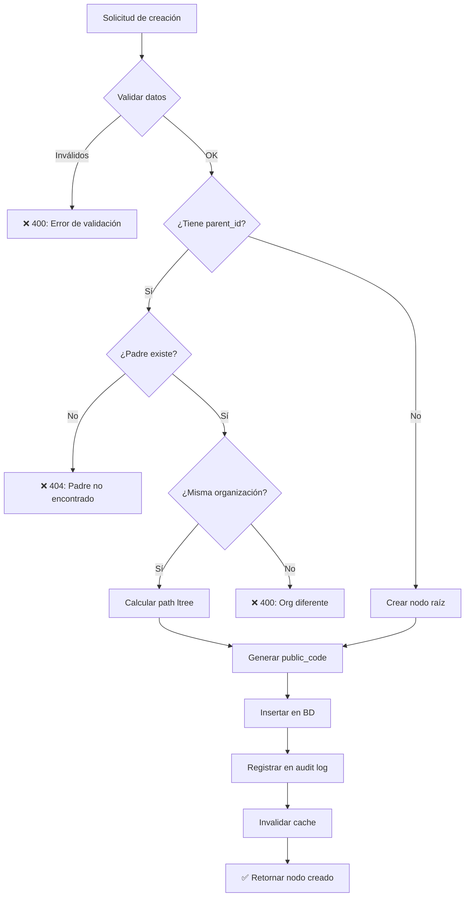
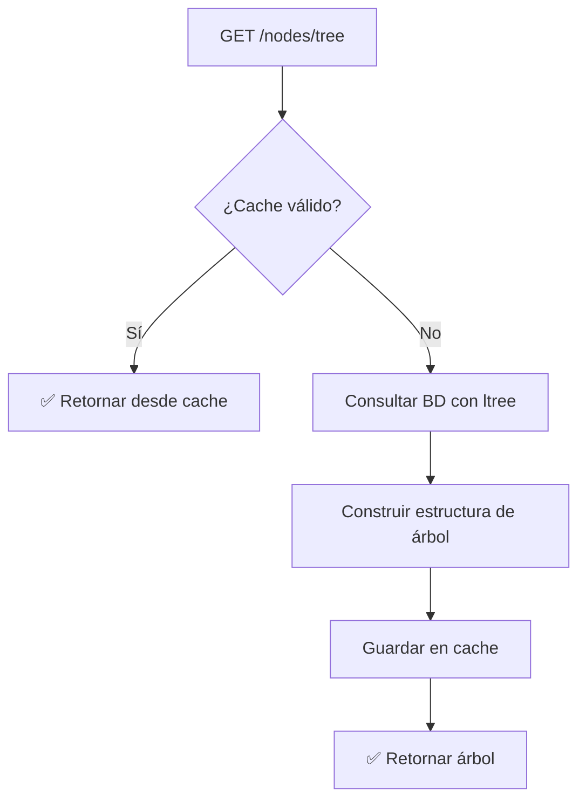
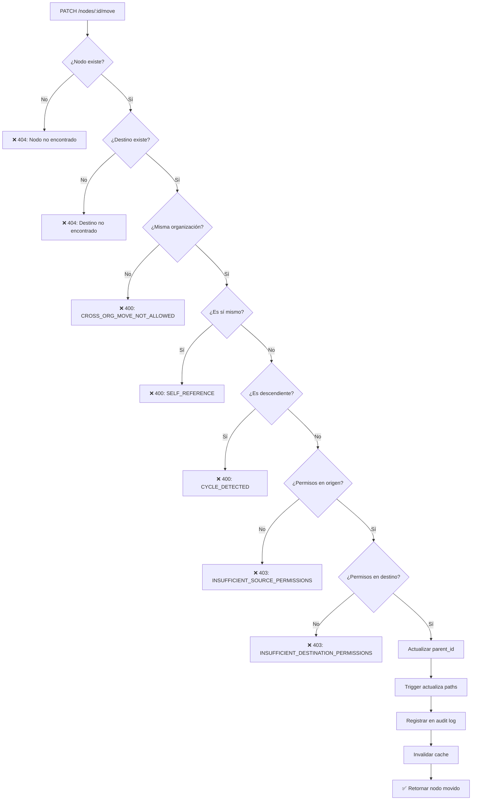
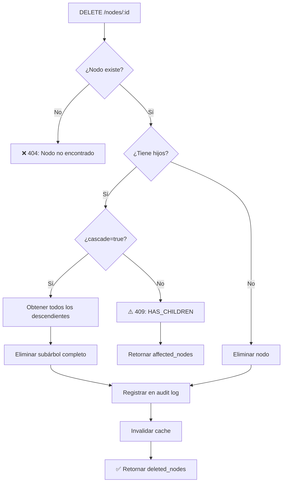
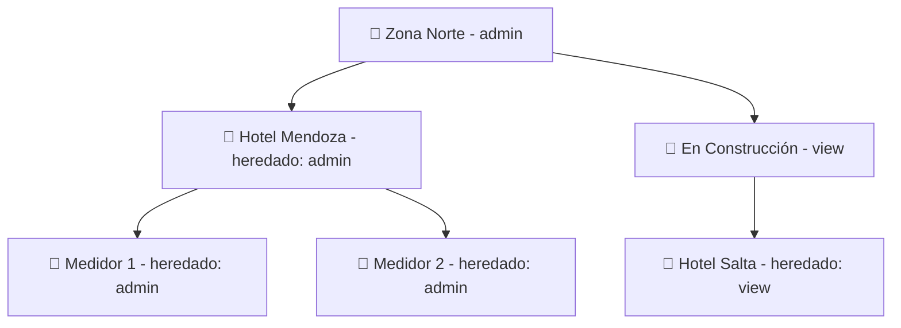

# Flujo de Resource Hierarchy

Este documento explica cómo funciona el sistema de jerarquía de recursos para organizar carpetas, sitios y canales.

> **Términos técnicos:** Si encontrás palabras desconocidas, consultá el [Glosario](../glosario.md).

---

## Resumen Ejecutivo

Resource Hierarchy permite organizar recursos (carpetas, sitios, canales) en una estructura de árbol flexible. Usa **ltree** (→ Glosario) de PostgreSQL para consultas eficientes de ancestros y descendientes.

**Características principales:**
- Profundidad ilimitada de carpetas
- Cualquier tipo de nodo puede contener cualquier otro tipo
- Permisos heredables por rama
- Eliminación en cascada con confirmación

---

## 1. Tipos de Nodos

| Tipo | Icono | Descripción | Puede contener |
|------|-------|-------------|----------------|
| `folder` | 📁 | Carpeta organizativa | Cualquier tipo |
| `site` | 📍 | Ubicación física | Cualquier tipo |
| `channel` | 📡 | Canal de comunicación | Cualquier tipo |

**Ejemplo de estructura:**
```
📁 Zona Norte
├── 📍 Hotel Libertador Mendoza
│   ├── 📡 Medidor Principal
│   └── 📡 Medidor Piscina
└── 📁 En Construcción
    └── 📍 Hotel Libertador Salta
```

---

## 2. Crear Nodos

### Diagrama de Flujo



### Endpoint

```
POST /api/v1/resource-hierarchy/nodes
```

**Request:**
```json
{
  "node_type": "folder",
  "name": "Zona Norte",
  "description": "Hoteles de la región norte",
  "parent_id": "RES-xxx",
  "icon": "folder",
  "metadata": {
    "region": "norte",
    "responsable": "Juan Pérez"
  }
}
```

**Response (201):**
```json
{
  "ok": true,
  "data": {
    "id": "RES-yyy",
    "node_type": "folder",
    "name": "Zona Norte",
    "description": "Hoteles de la región norte",
    "parent_id": "RES-xxx",
    "depth": 1,
    "has_children": false,
    "icon": "folder",
    "is_active": true,
    "metadata": { "region": "norte" },
    "created_at": "2025-01-05T10:30:00Z"
  }
}
```

---

## 3. Obtener Árbol de Nodos

### Diagrama de Flujo



### Endpoint

```
GET /api/v1/resource-hierarchy/nodes/tree
```

**Parámetros de query:**
| Parámetro | Tipo | Descripción |
|-----------|------|-------------|
| `root_id` | string | Public code del nodo raíz (opcional) |
| `max_depth` | number | Profundidad máxima (default: 3, max: 50) |
| `include_counts` | boolean | Incluir conteo de hijos (default: true) |
| `node_types` | string | Filtrar por tipos (comma-separated) |

**Response:**
```json
{
  "ok": true,
  "data": [
    {
      "id": "RES-xxx",
      "name": "Zona Norte",
      "node_type": "folder",
      "depth": 0,
      "has_children": true,
      "children_count": 2,
      "children": [
        {
          "id": "RES-yyy",
          "name": "Hotel Mendoza",
          "node_type": "site",
          "depth": 1,
          "has_children": true,
          "children": [...]
        }
      ]
    }
  ]
}
```

---

## 4. Mover Nodos

### Diagrama de Flujo con Guards



### Validaciones de Seguridad

| Guard | Código de Error | Qué previene |
|-------|-----------------|--------------|
| Auto-referencia | `SELF_REFERENCE` | Mover un nodo a sí mismo |
| Detección de ciclos | `CYCLE_DETECTED` | Mover un nodo dentro de sus propios hijos |
| Cross-org | `CROSS_ORG_MOVE_NOT_ALLOWED` | Mover entre organizaciones diferentes |
| Permisos origen | `INSUFFICIENT_SOURCE_PERMISSIONS` | Mover sin permiso 'edit' en el nodo |
| Permisos destino | `INSUFFICIENT_DESTINATION_PERMISSIONS` | Mover a destino sin permiso 'edit' |

### Endpoint

```
PATCH /api/v1/resource-hierarchy/nodes/:publicCode/move
```

**Request:**
```json
{
  "new_parent_id": "RES-destino"
}
```

Para mover a la raíz:
```json
{
  "new_parent_id": null
}
```

**Response exitosa:**
```json
{
  "ok": true,
  "data": {
    "id": "RES-xxx",
    "name": "Mi Nodo",
    "parent_id": "RES-destino",
    "depth": 2
  }
}
```

---

## 5. Eliminar Nodos (Cascade Delete)

### Diagrama de Flujo



### Flujo de Confirmación (UX)

1. **Usuario intenta eliminar nodo con hijos (sin cascade)**
   - API devuelve 409 con lista de nodos afectados
   - Frontend muestra modal de confirmación

2. **Usuario confirma**
   - Frontend reintenta con `?cascade=true`
   - API elimina todo el subárbol

### Endpoint

```
DELETE /api/v1/resource-hierarchy/nodes/:publicCode?cascade=true
```

**Sin cascade (nodo con hijos) - Response 409:**
```json
{
  "ok": false,
  "error": {
    "code": "HAS_CHILDREN",
    "message": "El nodo tiene hijos. Use cascade=true para eliminar todo el subárbol",
    "affected_nodes": [
      { "id": "RES-xxx", "name": "Carpeta", "node_type": "folder" },
      { "id": "RES-yyy", "name": "Subcarpeta", "node_type": "folder" },
      { "id": "CHN-zzz", "name": "Canal 1", "node_type": "channel" }
    ]
  }
}
```

**Con cascade - Response 200:**
```json
{
  "ok": true,
  "data": {
    "deleted_nodes": [
      { "id": "RES-xxx", "name": "Carpeta", "node_type": "folder" },
      { "id": "RES-yyy", "name": "Subcarpeta", "node_type": "folder" },
      { "id": "CHN-zzz", "name": "Canal 1", "node_type": "channel" }
    ],
    "count": 3
  }
}
```

---

## 6. Permisos por Nodo

### Niveles de Acceso

| Nivel | Puede Ver | Puede Editar | Puede Administrar |
|-------|-----------|--------------|-------------------|
| `view` | ✅ | ❌ | ❌ |
| `edit` | ✅ | ✅ | ❌ |
| `admin` | ✅ | ✅ | ✅ |

### Herencia de Permisos

Los permisos se heredan hacia abajo en el árbol:
- Si tenés `edit` en una carpeta, tenés `edit` en todos sus contenidos
- Un permiso explícito en un nodo hijo sobreescribe la herencia

### Diagrama de Herencia



En este ejemplo:
- Usuario tiene `admin` explícito en "Zona Norte"
- Hereda `admin` en Hotel Mendoza y sus canales
- Tiene `view` explícito en "En Construcción"
- Hereda solo `view` en Hotel Salta

---

## 7. Estructura de Base de Datos

### Tabla `resource_hierarchy`

| Campo | Tipo | Descripción |
|-------|------|-------------|
| `id` | UUID | ID interno (nunca expuesto) |
| `public_code` | VARCHAR | ID público (ej: RES-xxx) |
| `organization_id` | UUID | Organización dueña |
| `parent_id` | UUID | Referencia al padre |
| `path` | LTREE | Path completo para queries eficientes |
| `depth` | INT | Profundidad en el árbol |
| `node_type` | ENUM | folder, site, channel |
| `name` | VARCHAR | Nombre del nodo |
| `is_active` | BOOLEAN | Soft delete |

### Índices Optimizados

```sql
-- Búsqueda de hijos directos
CREATE INDEX idx_children ON resource_hierarchy(parent_id) 
  WHERE deleted_at IS NULL;

-- Búsqueda de nodos raíz
CREATE INDEX idx_roots ON resource_hierarchy(organization_id) 
  WHERE parent_id IS NULL AND deleted_at IS NULL;

-- Queries de ancestros/descendientes
CREATE INDEX idx_path ON resource_hierarchy USING GIST(path);
```

---

## 8. Cache y Performance

### Estrategia de Cache (Redis)

| Clave | TTL | Contenido |
|-------|-----|-----------|
| `hierarchy:org:{orgId}:tree` | 5 min | Árbol completo |
| `hierarchy:node:{publicCode}` | 15 min | Nodo individual |
| `hierarchy:node:{publicCode}:children` | 5 min | Hijos directos |

### Invalidación Automática

El cache se invalida automáticamente cuando:
- Se crea un nodo (invalida tree y padre)
- Se mueve un nodo (invalida tree, origen y destino)
- Se elimina un nodo (invalida tree y ancestros)

---

## Códigos de Error Completos

| Código HTTP | Error Code | Cuándo ocurre |
|-------------|------------|---------------|
| 400 | `VALIDATION_ERROR` | Datos de entrada inválidos |
| 400 | `SELF_REFERENCE` | Mover nodo a sí mismo |
| 400 | `CYCLE_DETECTED` | Mover nodo a sus descendientes |
| 400 | `CROSS_ORG_MOVE_NOT_ALLOWED` | Mover entre organizaciones |
| 403 | `INSUFFICIENT_SOURCE_PERMISSIONS` | Sin permiso en nodo origen |
| 403 | `INSUFFICIENT_DESTINATION_PERMISSIONS` | Sin permiso en destino |
| 404 | `NODE_NOT_FOUND` | Nodo no existe |
| 404 | `PARENT_NOT_FOUND` | Padre no existe |
| 409 | `HAS_CHILDREN` | Eliminar sin cascade |

---

## Referencias

- [Glosario de términos](../glosario.md)
- [Sistema de Organizaciones](./04-organizaciones.md)
- [Autenticación y Permisos](./01-autenticacion.md)
