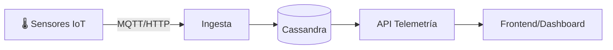
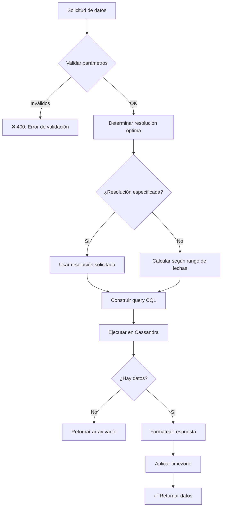
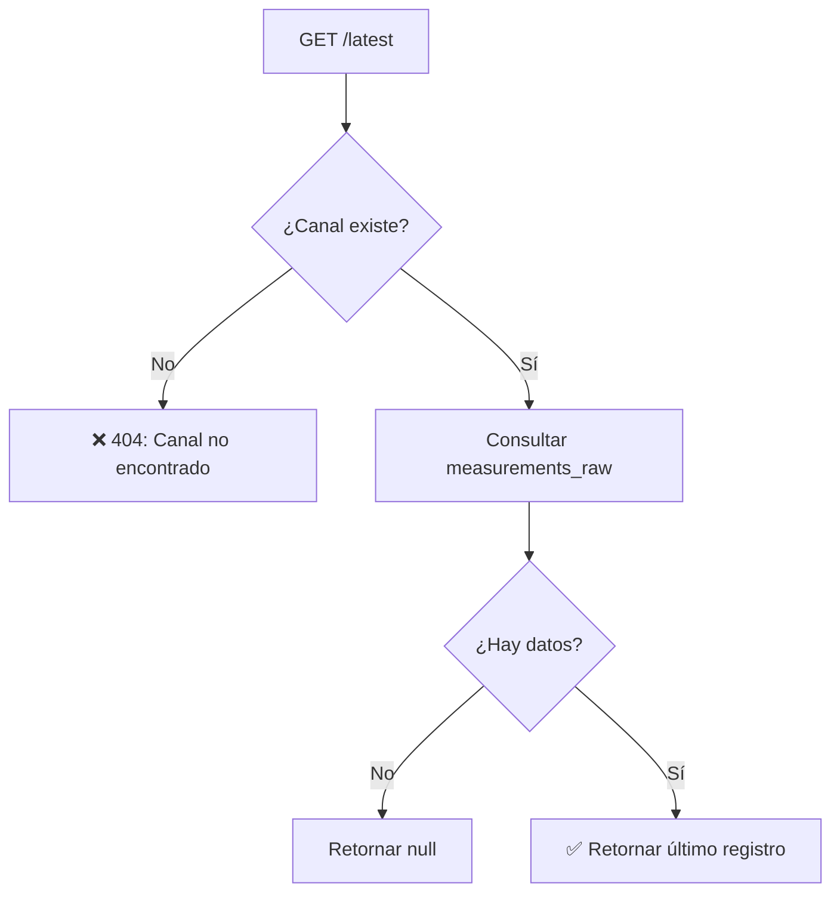
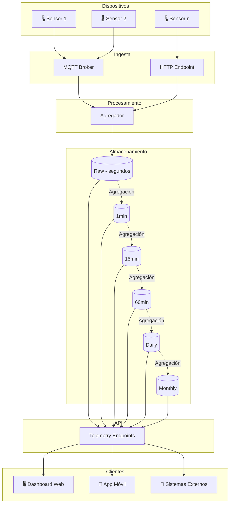

# Flujo de Telemetría

Este documento explica cómo funciona el sistema de consulta de datos de telemetría desde Apache Cassandra.

> **Términos técnicos:** Si encontrás palabras desconocidas, consultá el [Glosario](../glosario.md).

---

## Resumen Ejecutivo

El módulo de telemetría permite consultar datos de sensores IoT almacenados en Apache Cassandra. Los datos se guardan en diferentes **resoluciones temporales** para optimizar consultas históricas.

**Características principales:**
- Datos en tiempo real y históricos
- Múltiples resoluciones (raw, 1min, 15min, 1hora, diario, mensual)
- Filtros por canal, rango de fechas, variables
- Traducciones multi-idioma para nombres de variables

---

## 1. Arquitectura de Datos

### Flujo de Datos



### Tablas por Resolución

| Tabla | Resolución | Uso típico | Retención |
|-------|------------|------------|-----------|
| `measurements_raw` | Segundos | Últimas horas | 7 días |
| `measurements_1m` | 1 minuto | Último día | 30 días |
| `measurements_15m` | 15 minutos | Última semana | 90 días |
| `measurements_60m` | 1 hora | Último mes | 1 año |
| `measurements_daily` | 1 día | Histórico | 5 años |
| `measurements_monthly` | 1 mes | Reportes anuales | Indefinido |

---

## 2. Consultar Datos Históricos

### Diagrama de Flujo



### Selección Automática de Resolución

Si no especificás resolución, el sistema la calcula según el rango de fechas:

| Rango de Fechas | Resolución Automática |
|-----------------|----------------------|
| < 6 horas | raw (segundos) |
| 6 - 24 horas | 1m |
| 1 - 7 días | 15m |
| 7 - 30 días | 60m |
| 30 - 365 días | daily |
| > 365 días | monthly |

### Endpoint

```
GET /api/v1/telemetry/measurements
```

**Parámetros de query:**

| Parámetro | Tipo | Requerido | Descripción |
|-----------|------|-----------|-------------|
| `channel_id` | string | ✅ | Public code del canal |
| `start_date` | ISO8601 | ✅ | Fecha inicio |
| `end_date` | ISO8601 | ✅ | Fecha fin |
| `resolution` | string | ❌ | raw, 1m, 15m, 60m, daily, monthly |
| `variables` | string | ❌ | Variables específicas (comma-separated) |
| `timezone` | string | ❌ | Timezone para fechas (default: UTC) |
| `limit` | number | ❌ | Máximo de registros (default: 1000) |

**Ejemplo de request:**
```
GET /api/v1/telemetry/measurements?channel_id=CHN-5LYJX-4&start_date=2025-01-01T00:00:00Z&end_date=2025-01-02T00:00:00Z&resolution=15m&timezone=America/Argentina/Buenos_Aires
```

**Response:**
```json
{
  "ok": true,
  "data": {
    "channel_id": "CHN-5LYJX-4",
    "resolution": "15m",
    "timezone": "America/Argentina/Buenos_Aires",
    "count": 96,
    "measurements": [
      {
        "timestamp": "2025-01-01T00:00:00-03:00",
        "energia_activa": 1234.56,
        "energia_reactiva": 89.12,
        "potencia_activa": 45.67
      },
      {
        "timestamp": "2025-01-01T00:15:00-03:00",
        "energia_activa": 1235.78,
        "energia_reactiva": 89.45,
        "potencia_activa": 46.12
      }
    ]
  },
  "meta": {
    "start_date": "2025-01-01T00:00:00-03:00",
    "end_date": "2025-01-02T00:00:00-03:00",
    "resolution": "15m",
    "points_returned": 96,
    "points_expected": 96
  }
}
```

---

## 3. Consultar Último Valor

Obtiene el valor más reciente de un canal (útil para dashboards en tiempo real).

### Diagrama de Flujo



### Endpoint

```
GET /api/v1/telemetry/measurements/latest
```

**Parámetros:**
| Parámetro | Tipo | Requerido | Descripción |
|-----------|------|-----------|-------------|
| `channel_id` | string | ✅ | Public code del canal |

**Response:**
```json
{
  "ok": true,
  "data": {
    "channel_id": "CHN-5LYJX-4",
    "timestamp": "2025-01-05T15:32:45Z",
    "values": {
      "energia_activa": 5678.90,
      "potencia_activa": 123.45,
      "factor_potencia": 0.95
    },
    "age_seconds": 12
  }
}
```

---

## 4. Variables de Telemetría

Las variables definen qué datos se miden y cómo se muestran.

### Estructura de Variable

```json
{
  "id": "VAR-xxx",
  "column_name": "energia_activa",
  "measurement_type_id": "MT-001",
  "unit": "kWh",
  "aggregation_type": "sum",
  "chart_type": "line",
  "is_realtime": true,
  "is_default": true,
  "show_in_billing": true,
  "show_in_analysis": true,
  "translations": {
    "es": {
      "name": "Energía Activa",
      "description": "Consumo de energía activa acumulado"
    },
    "en": {
      "name": "Active Energy",
      "description": "Accumulated active energy consumption"
    }
  }
}
```

### CRUD de Variables

```
GET    /api/v1/telemetry/variables          # Listar
POST   /api/v1/telemetry/variables          # Crear
GET    /api/v1/telemetry/variables/:id      # Obtener una
PUT    /api/v1/telemetry/variables/:id      # Actualizar
DELETE /api/v1/telemetry/variables/:id      # Eliminar
```

### Filtros Disponibles

| Parámetro | Descripción |
|-----------|-------------|
| `search` | Buscar en nombre/descripción/column_name |
| `measurementTypeId` | Filtrar por tipo de medición |
| `isRealtime` | Solo variables en tiempo real |
| `isDefault` | Solo variables por defecto |
| `showInBilling` | Variables para facturación |
| `showInAnalysis` | Variables para análisis |
| `chartType` | Tipo de gráfico (line, bar, area) |
| `aggregationType` | Tipo de agregación (sum, avg, max, min) |

---

## 5. Tipos de Agregación

Cuando los datos se agregan (resúmenes por hora, día, etc.), se aplican diferentes métodos según el tipo de variable:

| Tipo | Descripción | Uso típico |
|------|-------------|------------|
| `sum` | Suma de valores | Energía consumida |
| `avg` | Promedio | Temperatura, humedad |
| `max` | Valor máximo | Picos de potencia |
| `min` | Valor mínimo | Mínimos de tensión |
| `last` | Último valor | Contadores, acumuladores |
| `first` | Primer valor | Estado inicial |
| `count` | Cantidad de registros | Eventos, alarmas |

---

## 6. Timezones y Fechas

### Manejo de Fechas

- Cassandra almacena todo en **UTC**
- La API acepta fechas en cualquier formato ISO8601
- El parámetro `timezone` ajusta las fechas de salida

### Ejemplo de Conversión

```
Input:
  start_date: "2025-01-01T00:00:00-03:00"
  timezone: "America/Argentina/Buenos_Aires"

Proceso:
  1. Convertir a UTC: "2025-01-01T03:00:00Z"
  2. Consultar Cassandra con UTC
  3. Convertir respuesta a timezone solicitado

Output:
  timestamp: "2025-01-01T00:00:00-03:00"
```

---

## 7. Estructura en Cassandra

### Esquema de Tabla (measurements_raw)

```cql
CREATE TABLE sensores.measurements_raw (
    channel_id UUID,
    timestamp TIMESTAMP,
    energia_activa DOUBLE,
    energia_reactiva DOUBLE,
    potencia_activa DOUBLE,
    potencia_reactiva DOUBLE,
    tension_l1 DOUBLE,
    tension_l2 DOUBLE,
    tension_l3 DOUBLE,
    corriente_l1 DOUBLE,
    corriente_l2 DOUBLE,
    corriente_l3 DOUBLE,
    factor_potencia DOUBLE,
    frecuencia DOUBLE,
    PRIMARY KEY (channel_id, timestamp)
) WITH CLUSTERING ORDER BY (timestamp DESC);
```

### Keyspace

```cql
CREATE KEYSPACE sensores 
  WITH replication = {'class': 'SimpleStrategy', 'replication_factor': 3};
```

---

## 8. Diagrama de Arquitectura Completa



---

## 9. Códigos de Error

| Código | Error Code | Cuándo ocurre |
|--------|------------|---------------|
| 400 | `VALIDATION_ERROR` | Parámetros inválidos |
| 400 | `INVALID_DATE_RANGE` | end_date antes de start_date |
| 400 | `INVALID_RESOLUTION` | Resolución no soportada |
| 400 | `DATE_RANGE_TOO_LARGE` | Rango excede límite permitido |
| 404 | `CHANNEL_NOT_FOUND` | Canal no existe |
| 404 | `NO_DATA` | No hay datos en el rango |
| 503 | `CASSANDRA_UNAVAILABLE` | Error de conexión a Cassandra |

---

## 10. Límites y Rate Limiting

| Límite | Valor |
|--------|-------|
| Máximo registros por consulta | 10,000 |
| Rango máximo raw | 24 horas |
| Rango máximo 1m | 7 días |
| Rango máximo 15m | 30 días |
| Rango máximo 60m | 365 días |
| Rate limit por IP | 60 req/min |

---

## Referencias

- [Glosario de términos](../glosario.md)
- [Sistema de Canales](./02-resource-hierarchy.md)
- [API Keys para acceso M2M](./05-api-keys.md)
