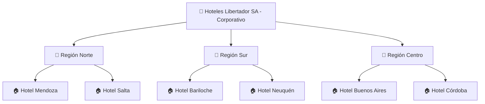
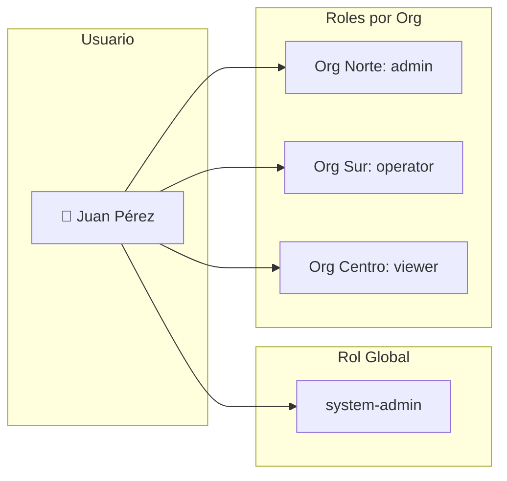
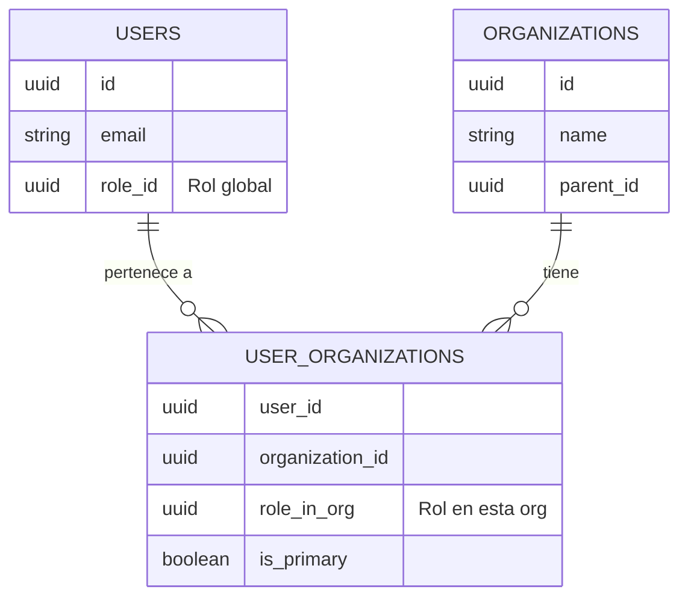
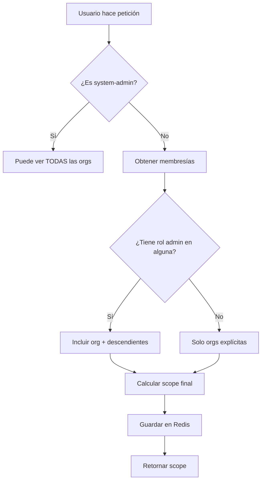
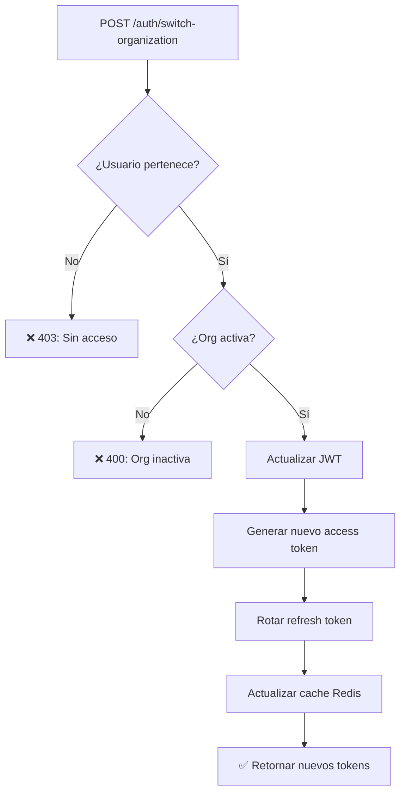
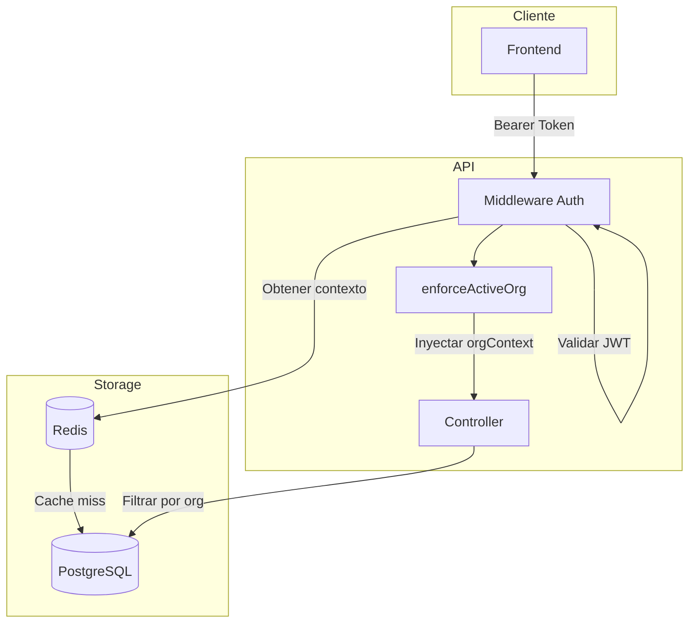

# Flujo de Organizaciones

Este documento explica cómo funciona el sistema de organizaciones multi-tenant, roles y permisos.

> **Términos técnicos:** Si encontrás palabras desconocidas, consultá el [Glosario](../glosario.md).

---

## Resumen Ejecutivo

EC.DATA es un sistema **multi-tenant** (→ Glosario) donde cada organización tiene sus propios datos completamente aislados. Los usuarios pueden pertenecer a múltiples organizaciones con diferentes roles en cada una.

**Características principales:**
- Jerarquía de organizaciones (padre-hijo)
- Sistema híbrido de roles (global + por organización)
- Usuarios pueden pertenecer a múltiples organizaciones
- Cambio de organización activa sin re-login

---

## 1. Estructura de Organizaciones

### Jerarquía



### Campos de Organización

| Campo | Descripción |
|-------|-------------|
| `id` | Public code (ej: ORG-xxx) |
| `name` | Nombre de la organización |
| `parent_id` | Organización padre (null si es raíz) |
| `level` | Nivel en la jerarquía (0 = raíz) |
| `is_active` | Si está activa |
| `settings` | Configuraciones personalizadas |

---

## 2. Sistema Híbrido de Roles

### Diagrama Conceptual



### Tipos de Roles

**Rol Global** (tabla `users.role_id`)
- Aplica a nivel de todo el sistema
- Define el nivel máximo de acceso

| Rol | Descripción |
|-----|-------------|
| `system-admin` | Acceso total al sistema |
| `support` | Soporte técnico (lectura global) |
| `user` | Usuario normal (requiere roles por org) |

**Rol por Organización** (tabla `user_organizations.role_in_org`)
- Aplica solo dentro de esa organización
- Puede variar entre organizaciones

| Rol | Ver | Editar | Administrar |
|-----|-----|--------|-------------|
| `admin` | ✅ | ✅ | ✅ |
| `manager` | ✅ | ✅ | ❌ |
| `operator` | ✅ | ✅* | ❌ |
| `viewer` | ✅ | ❌ | ❌ |

*Operator puede editar datos operativos pero no configuraciones

---

## 3. Membresía Multi-Organización

### Diagrama de Relación



### Propiedades de la Membresía

| Campo | Descripción |
|-------|-------------|
| `is_primary` | Organización principal del usuario |
| `role_in_org` | Rol del usuario en esta organización |
| `joined_at` | Fecha de ingreso |
| `invited_by` | Quién lo invitó |

---

## 4. Cálculo de Scope (Alcance)

El "scope" determina qué organizaciones puede ver un usuario.

### Diagrama de Cálculo



### Ejemplo de Scope

```
Usuario: Juan (user)
Membresías:
  - Org Norte (admin)
  - Org Buenos Aires (viewer)

Scope calculado:
  - Org Norte ✅ (admin)
  - Hotel Mendoza ✅ (hereda de Norte)
  - Hotel Salta ✅ (hereda de Norte)
  - Org Buenos Aires ✅ (viewer explícito)
  - Org Sur ❌ (sin acceso)
  - Org Centro ❌ (sin acceso)
```

---

## 5. Cambio de Organización Activa

### Diagrama de Flujo



### Endpoint

```
POST /api/v1/auth/switch-organization
```

**Request:**
```json
{
  "organizationId": "ORG-xxx"
}
```

**Response:**
```json
{
  "ok": true,
  "data": {
    "accessToken": "nuevo-jwt...",
    "refreshToken": "nuevo-refresh...",
    "activeOrganization": {
      "id": "ORG-xxx",
      "name": "Hotel Mendoza",
      "role": "admin"
    }
  }
}
```

---

## 6. Contexto de Organización en Peticiones

### Inyección Automática

El middleware inyecta el contexto de organización en cada petición:

```javascript
req.organizationContext = {
    id: 'uuid',                    // UUID interno (resuelto)
    publicCode: 'ORG-xxx',         // Public code
    source: 'jwt',                 // jwt | query | api_key
    tokenType: 'session',          // session | api_key
    scopes: [],                    // Scopes del API key
    allowedIds: ['uuid1', 'uuid2'], // Orgs permitidas
    enforced: true,                // Si se aplica filtrado
    canAccessAll: false            // true si es admin global
};
```

### Filtrado Automático

Todos los endpoints de listado filtran automáticamente por organización:

```
GET /api/v1/channels
→ Solo retorna canales de la organización activa

GET /api/v1/channels?all=true (solo admins)
→ Retorna canales de TODAS las organizaciones permitidas
```

---

## 7. CRUD de Organizaciones

### Crear Organización

```
POST /api/v1/organizations
```

**Request:**
```json
{
  "name": "Hotel Mendoza",
  "parent_id": "ORG-region-norte",
  "settings": {
    "timezone": "America/Argentina/Mendoza",
    "currency": "ARS"
  }
}
```

### Listar Organizaciones

```
GET /api/v1/organizations
```

**Filtros:**
| Parámetro | Descripción |
|-----------|-------------|
| `parent_id` | Filtrar por padre |
| `include_children` | Incluir hijos (default: false) |
| `is_active` | Filtrar por estado |

### Árbol de Organizaciones

```
GET /api/v1/organizations/tree
```

**Response:**
```json
{
  "ok": true,
  "data": [
    {
      "id": "ORG-xxx",
      "name": "Hoteles Libertador SA",
      "level": 0,
      "children_count": 3,
      "children": [
        {
          "id": "ORG-norte",
          "name": "Región Norte",
          "level": 1,
          "children_count": 2,
          "children": [...]
        }
      ]
    }
  ]
}
```

---

## 8. Gestión de Usuarios en Organizaciones

### Invitar Usuario

```
POST /api/v1/organizations/:orgId/users
```

**Request:**
```json
{
  "email": "nuevo@usuario.com",
  "role_in_org": "operator"
}
```

### Listar Usuarios de Organización

```
GET /api/v1/organizations/:orgId/users
```

### Cambiar Rol de Usuario

```
PATCH /api/v1/organizations/:orgId/users/:userId
```

**Request:**
```json
{
  "role_in_org": "admin"
}
```

### Remover Usuario

```
DELETE /api/v1/organizations/:orgId/users/:userId
```

---

## 9. Cache de Contexto (Redis)

### Estructura del Cache

```
session:{userId}:{sessionId} = {
    activeOrgId: "uuid",
    allowedOrgs: ["uuid1", "uuid2", ...],
    role: "operator",
    permissions: ["channels:read", "channels:write", ...],
    expiresAt: timestamp
}
```

### TTL y Invalidación

| Clave | TTL | Se invalida cuando |
|-------|-----|-------------------|
| Session context | 15 min | Logout, switch-org |
| User permissions | 5 min | Cambio de rol |
| Org scope | 10 min | Cambio en membresías |

---

## 10. Diagrama de Arquitectura



---

## 11. Códigos de Error

| Código | Error Code | Cuándo ocurre |
|--------|------------|---------------|
| 400 | `VALIDATION_ERROR` | Datos inválidos |
| 400 | `CIRCULAR_REFERENCE` | Org padre es descendiente |
| 403 | `NOT_A_MEMBER` | Usuario no pertenece a la org |
| 403 | `INSUFFICIENT_PERMISSIONS` | Sin permisos para la acción |
| 404 | `ORGANIZATION_NOT_FOUND` | Org no existe |
| 409 | `ALREADY_A_MEMBER` | Usuario ya está en la org |
| 409 | `CANNOT_REMOVE_LAST_ADMIN` | Org quedaría sin admins |

---

## Referencias

- [Glosario de términos](../glosario.md)
- [Autenticación](./01-autenticacion.md)
- [API Keys](./05-api-keys.md)
